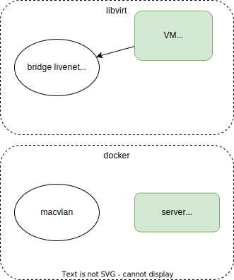

# Livenet 2023

* http://c-nergy.be/blog/?p=13771
* [nbd](https://www.adrian.idv.hk/2022-09-30-diskless/)
* [docker dhcp](https://github.com/FlorentTomasin/docker_dhcp_nfs_tftp_server)
* [iPXE boot images](https://netboot.xyz/downloads/)
* [dnsmasq with tftp](https://github.com/matteoraf/dnsmasq-tftp-pxe)


## Schema 




## VM client

add "allow br-livenet" to /etc/qemu/bridge.conf

virt-install --osinfo list

create VM that boot from network
```
sudo virt-install --connect qemu:///system \
    --name testvm \
    --network=bridge:br-livenet --pxe \
    --ram=2048 \
    --vcpus=2 \
    --os-type=linux --os-variant=ubuntu22.04 \
    --disk path=/var/lib/libvirt/images/testvm.qcow2,size=40
``` 


